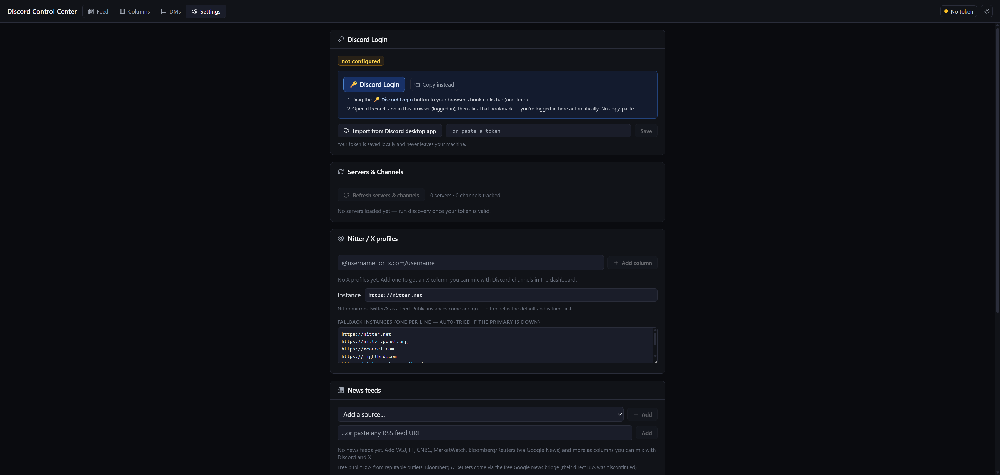

# 📖 Anleitung — Discord Control Center

Diese Anleitung führt dich Schritt für Schritt durch alles. Du brauchst **keine** Technik-Kenntnisse und musst **nichts** installieren. Wenn du an einer Stelle hängst, schau unten unter [„Es klappt nicht?"](#-es-klappt-nicht-problemlösung).

**Voraussetzung:** Ein Windows-10- oder Windows-11-PC. Das war's.

---

## 1. Herunterladen

1. Gehe auf die **[Releases-Seite](https://github.com/Tobi24897/DiscordControlCenter/releases/latest)** des Projekts.
2. Lade dort die Datei **`DiscordControlCenter.zip`** herunter (unter „Assets").

> ⚠️ Benutze **nicht** den grünen Knopf „Code → Download ZIP" auf der Startseite. Der enthält nur den Quellcode, **nicht** das fertige Programm mit Python. Es muss die ZIP aus dem **Releases**-Bereich sein.

---

## 2. Entpacken

1. Die heruntergeladene `DiscordControlCenter.zip` im Downloads-Ordner suchen.
2. **Rechtsklick → „Alle extrahieren…"** → „Extrahieren".
3. Den entpackten Ordner an einen festen Platz schieben, z. B. auf den **Desktop**.

> ⚠️ **Wichtig:** Das Tool muss aus dem **entpackten** Ordner gestartet werden — **nicht** aus der ZIP heraus (also nicht doppelt in die ZIP klicken und von dort starten). Sonst findet es seine Dateien nicht.

---

## 3. Starten

Im entpackten Ordner liegt eine Datei namens:

> **`Discord Control Center starten.vbs`**

**Doppelklick** darauf. Nach ein paar Sekunden öffnet sich automatisch dein Browser mit dem Dashboard.

### „Windows hat Ihren PC geschützt" — was tun?

Beim allerersten Start zeigt Windows vielleicht ein blaues Fenster „Windows hat Ihren PC geschützt" (SmartScreen). Das ist normal bei kleinen, nicht teuer signierten Programmen und **kein Virus**.

→ Klick auf **„Weitere Informationen"** und dann auf **„Trotzdem ausführen"**.

Falls dein Virenscanner anschlägt: Das Tool startet ein kleines Skript (`.vbs`) — kein Virus, der komplette Quellcode ist offen einsehbar. Bei **Windows Defender** trägst du den entpackten Ordner so als Ausnahme ein: Suchfeld → **„Windows-Sicherheit"** → „Viren- & Bedrohungsschutz" → „Einstellungen verwalten" → ganz unten „Ausschlüsse hinzufügen oder entfernen" → „Ordner" → den entpackten Ordner wählen.

### Lieber ein Symbol auf dem Desktop?

Doppelklick auf **`Desktop-Verknuepfung erstellen.vbs`** im Ordner. Danach liegt ein **„Discord Control Center"**-Symbol auf dem Desktop, über das du das Tool künftig direkt startest.

---

## 4. Einmalig: Mit Discord einloggen

Damit das Tool deine Discord-Channels lesen kann, muss es sich einmal mit deinem Discord verbinden. **Du musst dafür nichts Kompliziertes machen** — ein Lesezeichen-Klick reicht.

> Hintergrund: Das Tool meldet sich mit deinem normalen Discord-Login an (dein „Token"). Du tippst dabei **kein Passwort** ins Tool. Das Lesezeichen holt den Login direkt aus deinem bereits eingeloggten Discord im Browser.



**So geht's (einfachster Weg — der „🔑 Discord Login"-Knopf):**

1. Im Tool oben auf **Einstellungen** (Settings) klicken. Dort gibt es einen Knopf **„🔑 Discord Login"**.
2. **Blende zuerst die Lesezeichenleiste ein.** Das ist die schmale Leiste direkt **unter der Adresszeile**, in der gespeicherte Webseiten liegen. Siehst du sie nicht? Drücke **`Strg + Umschalt + B`** — dann erscheint sie.
3. **Ziehe** den Knopf **„🔑 Discord Login"** mit gedrückter Maustaste in diese Leiste und lass ihn dort los. Er liegt jetzt als kleines Lesezeichen oben in der Leiste.
4. Öffne einen neuen Tab, gehe auf **[discord.com](https://discord.com)** und logge dich dort ganz normal ein (falls nicht schon eingeloggt).
5. Klicke jetzt — während Discord offen ist — oben in der Lesezeichenleiste auf dein neues **„🔑 Discord Login"**.
6. Es öffnet sich automatisch wieder das Tool, oben erscheint ein grüner Hinweis **„Logged in as … ✓"**. **Fertig — du bist eingeloggt.**

**Nur als Notlösung (falls das Lesezeichen partout nicht klappt):**

> ⚠️ Dieser Weg ist deutlich technischer. Bist du unsicher, frag lieber kurz die Person, von der du das Tool hast — der Lesezeichen-Weg oben ist fast immer einfacher.

In den Einstellungen gibt es auch ein Feld zum **Einfügen eines Tokens**. Den Token bekommst du so:
1. Discord im Browser öffnen, `F12` drücken (Entwickler-Werkzeuge).
2. Reiter **„Network"** (Netzwerk) öffnen, irgendeine Zeile mit `discord.com` anklicken.
3. Rechts unter **„Request Headers"** die Zeile **`authorization`** suchen, deren langen Wert kopieren.
4. Im Tool ins Token-Feld einfügen → **Speichern**. Fertig.

Dein Login wird nur **lokal** in der Datei `.env` gespeichert und ausschließlich an Discord selbst geschickt — sonst nirgendwohin.

---

## 5. Channels & Quellen auswählen

1. In den **Einstellungen** auf den (englischsprachigen) Knopf **„Refresh servers & channels"** klicken — er heißt genau so und lädt deine Discord-Server und Kanäle.
2. Bei den Channels, die du verfolgen willst, das **Häkchen** setzen.
3. Wechsle oben auf **Feed** (alles in einem Strom) oder **Spalten** (jede Quelle als eigene Spalte).

### X / Twitter als Spalte

Einstellungen → **„Nitter / X profiles"** → deinen Twitter-/X-Benutzernamen (z. B. `DeItaone`, **ohne** das @-Zeichen) hinzufügen. Er erscheint als Spalte wie ein Discord-Channel. (Läuft über kostenlose Nitter-Feeds; wenn eine Spalte leer bleibt, in den Einstellungen die Nitter-Instanz wechseln.)

### News als Spalte

Einstellungen → **„News feeds"** → eine Voreinstellung wählen (WSJ, FT, CNBC, MarketWatch, Bloomberg & Reuters via Google News, Yahoo, Nasdaq …) oder eine beliebige RSS-Adresse einfügen. Jede Schlagzeile verlinkt auf den Artikel.

### DMs (Direktnachrichten)

Reiter **DMs**: Unterhaltungen und Gruppen lesen, **schreiben und antworten**, Freundesliste. Du kannst per **Strg + V** einen Screenshot direkt mit hineinkopieren oder Dateien per Büroklammer/Drag-&-Drop anhängen.

---

## 6. Bedienung — die wichtigsten Handgriffe

- **Spalten anordnen:** Spaltenüberschrift mit der Maus ziehen (oder die Pfeile nutzen). Wird gespeichert.
- **Spaltenbreite:** Der **S / M / L / XL**-Knopf pro Spalte.
- **Spalte „leeren":** Das Häkchen an der Spalte zeigt ab jetzt nur noch neue Nachrichten.
- **Verlauf-Tiefe:** Einstellungen → **„History window"** legt fest, wie weit zurück geladen und wie lange gespeichert wird (Standard: 1 Woche).
- **Benachrichtigungen:** Pro Channel an/aus, optional nur bei Stichwörtern. Beim ersten Mal fragt der Browser nach Erlaubnis für Desktop-Hinweise — „Zulassen".
- **`$TICKER`** anklicken → öffnet den TradingView-Chart.

---

## 7. Beenden

Einfach den **Browser-Tab schließen**. Das Tool fährt sich nach wenigen Sekunden von selbst komplett herunter — kein Hintergrundprozess bleibt übrig. Beim nächsten Doppelklick startet alles wieder frisch.

---

## 🛟 Es klappt nicht? (Problemlösung)

**Nach dem Doppelklick passiert nichts / kein Browser öffnet sich.**
- Warte 10–15 Sekunden — der erste Start dauert etwas.
- Öffne den Browser selbst und tippe in die Adresszeile: `http://localhost:8020`
- Hat SmartScreen/Virenscanner blockiert? Siehe Schritt 3.

**Der Browser zeigt „Diese Seite funktioniert nicht" / leere Seite.**
- Das Backend war noch nicht bereit. Seite **neu laden** (`F5`) oder **`Discord Control Center starten.vbs`** erneut doppelklicken.

**„Port 8020 belegt" / es startet doppelt.**
- Jeder Start beendet vorher automatisch die alte Instanz. Falls es klemmt: PC einmal neu starten und erneut versuchen.

**Spalten von X/Twitter bleiben leer.**
- Die kostenlosen Nitter-Server sind mal erreichbar, mal nicht. In den Einstellungen unter „Nitter / X profiles" eine andere Instanz eintragen.

**„Token ungültig" / rote Anzeige oben.**
- Dein Discord-Login ist abgelaufen. Einfach Schritt 4 (Lesezeichen-Klick) noch einmal machen.

**Discord-Bilder/Charts laden nicht.**
- Discord-Bild-Links laufen nach einiger Zeit ab; neue Nachrichten laden wieder normal.

---

## Aus dem Quellcode starten (für Entwickler)

Wer Python (3.12+) und Node selbst installiert hat, braucht das gebündelte `python\` nicht:

```
pip install -r requirements.txt
# Frontend ist in frontend/dist/ bereits gebaut; zum Neubauen:
#   cd frontend && npm install && npm run build
python backend/main.py
```

Standard-Port ist `8020` (in `.env` über `SERVER_PORT` änderbar; `.env.example` als Vorlage kopieren). Datenbank liegt in `data/crawler.db` (SQLite).

---

## ⚖️ Wichtiger Hinweis

Das Tool nutzt deinen persönlichen Discord-Login (User-Token), um die Discord-Schnittstelle zu lesen — dasselbe Prinzip wie das bekannte DiscordChatExporter. Das **Automatisieren eines normalen User-Accounts verstößt gegen die Discord-Nutzungsbedingungen**. Nutzung auf **eigenes Risiko**, ohne Gewähr. Das Tool liest bewusst langsam und schonend, und Nachrichten werden **nur manuell von dir** gesendet, nie automatisch oder massenhaft. Sei vernünftig und halte dich an die Regeln deiner Server.
